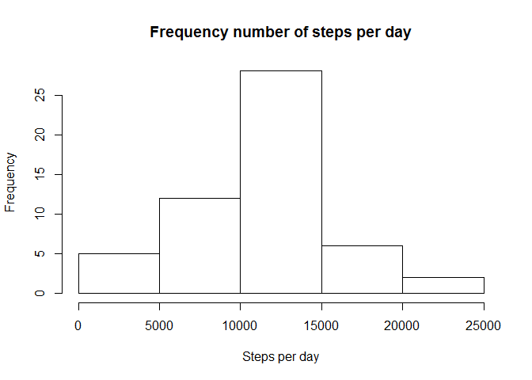
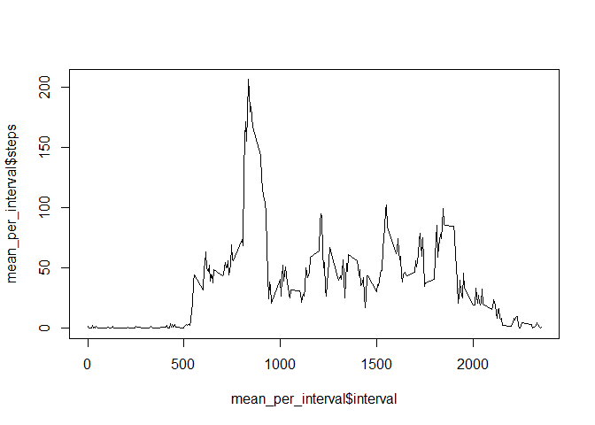
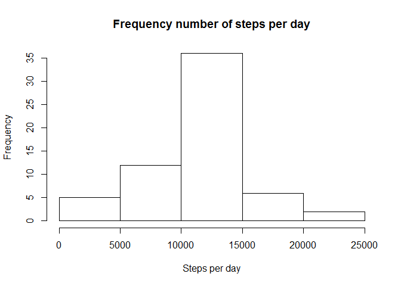
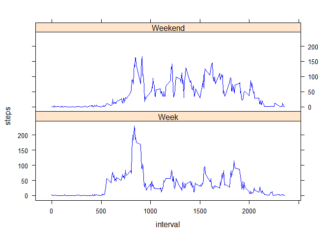

# Reproducible Research: Peer Assessment 1
This R Markdown document is Olaf Penne's submission for Reproducible Research Peer Assessment 1. The course assignment can be found here https://class.coursera.org/repdata-010/human_grading/view/courses/973511/assessments/3/submissions

This assignment makes use of data from a personal activity monitoring device. This device collects data at 5 minute intervals throughout the day. The data consists of two months of data from an anonymous individual collected during the months of October and November, 2012 and include the number of steps taken in 5 minute intervals each day. The original dataset can be found here https://d396qusza40orc.cloudfront.net/repdata%2Fdata%2Factivity.zip

The variables included in this dataset are:

steps: Number of steps taking in a 5-minute interval (missing values are coded as NA)
date: The date on which the measurement was taken in YYYY-MM-DD format
interval: Identifier for the 5-minute interval in which measurement was taken 

The dataset is stored in a comma-separated-value (CSV) file and there are a total of 17,568 observations in this dataset.

## Preparing the environment


```r
library(lattice)
```


## Loading and preprocessing the data
First set working directory.
Load csv file
Only preprocessing step needed is to change the class for the date to "date"


```r
setwd("~/03 Algemeen/Coursera/Assignments/Ass5_1")
activity<-read.csv("activity.csv")
activity$date<-as.Date(as.character(activity$date))
```


## What is mean total number of steps taken per day?

To calculate the number of steps, the total number of steps per day is calculated
In the histogram the distribution of total steps on a day is displayed


```r
sum_steps<-aggregate(activity$steps, by = list(activity$date),FUN=sum)
names(sum_steps)<-c("day","steps")
hist(sum_steps$steps, main="Frequency number of steps per day",xlab="Steps per day")
```




The mean and the median is calculated with the mean and the median function in R.


```r
mean_steps<-mean(sum_steps$steps,na.rm=TRUE)
median_steps<-median(sum_steps$steps,na.rm=TRUE)
print(paste("Mean: ",mean_steps))
```

```
## [1] "Mean:  10766.1886792453"
```

```r
print(paste("Median: ",median_steps))
```

```
## [1] "Median:  10765"
```


## What is the average daily activity pattern?

For the daily actvity pattern the average number of steps for a time interval is calculated. The pattern is displayed in the line plot.


```r
mean_per_interval<-aggregate(activity$steps, list(activity$interval), mean, na.rm=TRUE)
names(mean_per_interval)<-c("interval","steps")
plot(mean_per_interval$interval, mean_per_interval$steps,type="l")
```



To calculate the interval with the maximum number of steps:


```r
Max_Interval<-mean_per_interval$interval[mean_per_interval$steps==max(mean_per_interval$steps)]
print(paste("Max in interval: ",Max_Interval," Number of steps: ",max(mean_per_interval$steps)))
```

```
## [1] "Max in interval:  835  Number of steps:  206.169811320755"
```


## Imputing missing values
The missing values are replaced by the average number of steps for the interval for which the value is missing


```r
activity_corrected<-merge(activity,mean_per_interval,"interval")
names(activity_corrected)<-c("interval","steps","date","meansteps")
activity_corrected$steps<-ifelse(is.na(activity_corrected$steps),activity_corrected$meansteps,activity_corrected$steps)
```

This results in an updated histogram, and a recalculated mean and median.


```r
sum_steps_corrected<-aggregate(activity_corrected$steps, by = list(activity_corrected$date),FUN=sum)
names(sum_steps_corrected)<-c("day","steps")
hist(sum_steps_corrected$steps, main="Frequency number of steps per day",xlab="Steps per day")
```



```r
mean_steps_corrected<-mean(sum_steps_corrected$steps,na.rm=TRUE)
median_steps_corrected <-median(sum_steps_corrected$steps,na.rm=TRUE)
print(paste("Mean: ",mean_steps_corrected))
```

```
## [1] "Mean:  10766.1886792453"
```

```r
print(paste("Median: ",median_steps_corrected))
```

```
## [1] "Median:  10766.1886792453"
```


## Are there differences in activity patterns between weekdays and weekends?

The differences in the pattern for weekdays and weekends is displayed in this plot. For this analysis the dataset with the corrected missing values is used.


```r
activity_corrected$weekday<-ifelse(weekdays(activity_corrected$date)=="Saturday"|weekdays(activity_corrected$date)=="Sunday","Weekend","Week")
mean_per_interval_daytype<-aggregate(activity_corrected$steps, list(activity_corrected$interval,activity_corrected$weekday), mean, na.rm=TRUE)
names(mean_per_interval_daytype)<-c("interval","weekday","steps")
xyplot(steps~interval|weekday,mean_per_interval_daytype,type="l",col="blue",layout=c(1,2))
```



